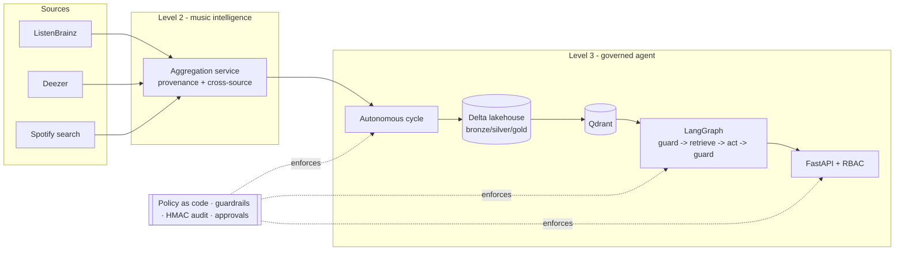

# Agentic AI Platform

Three progressively more capable AI agents in one `uv` workspace, plus the deployment quality
gates, container images and Kubernetes manifests needed to run the top one in production.

| Level | Package | What it does |
|---|---|---|
| 1 | `agents/level1-reddit-agent` | Tool-calling agent that queries Reddit (read-only OAuth) |
| 2 | `agents/level2-music-agent` | Music intelligence: latest releases, emerging artists, playlists, monthly global chart - also exposed as an **MCP server** |
| 3 | `agents/level3-autonomous-agent` | Autonomous, **governed** agent: level 2 + AI governance, responsible AI, medallion lakehouse, RAG over a vector database, HTTP API and an autonomous cycle |
| - | `packages/agent-core` | Shared agent loop, LLM providers, typed tool registry, hardened HTTP client, observability |
| - | `skills/deploy-quality-gates` | Reusable **Skill**: test and security gates before, during and after deployment |

Everything runs offline: `LLM_PROVIDER=heuristic` and `MUSIC_MODE=fixtures` give a deterministic
agent with synthetic data, which is what CI uses.

## Why not "just use the Spotify API"

The original ask was "latest tracks and the global Top 50 from Spotify". That is no longer
possible for a new app:

- **Spotify** (changes effective February/March 2026) removed `browse`/`new-releases`, artist top
  tracks, other users' playlists and profiles, and the batch endpoints from Development Mode
  apps; `popularity` and `follower` fields were dropped and search returns at most 10 items.
  Extended access requires a business review. There is no supported way to fetch "the global Top
  50" with new credentials.
- **Reddit** requires manual approval for OAuth since the Responsible Builder Policy
  (November 2025), and unauthenticated `.json` endpoints return `403` since 30 May 2026.

So the platform uses sources that are actually open and stable, and says so in every answer:

- **ListenBrainz** - fresh releases and *sitewide* monthly charts (`range=month`).
- **Deezer public API** - charts, editorial releases and playlists, used as a second opinion to
  measure cross-source agreement.
- **Spotify** - optional, only to resolve track links via search, when credentials exist.
- **Reddit** - level 1 only, with approved read-only credentials; never scraping.

See [`docs/adr/0001-music-data-sources.md`](docs/adr/0001-music-data-sources.md).

## Quickstart

```bash
uv sync --all-packages                # Python 3.12
cp .env.example .env                  # optional: real credentials

# Level 1 - Reddit (fixtures need no credentials)
uv run --frozen reddit-agent ask "What are people saying about DuckDB this week?" --mode fixtures

# Level 2 - music intelligence
uv run --frozen music-agent snapshot --mode fixtures
uv run --frozen music-agent ask "Which new artists are emerging?" --mode fixtures
uv run --frozen music-agent mcp                      # MCP server over stdio

# Level 3 - governed autonomous agent (offline)
export ENVIRONMENT=ci LLM_PROVIDER=heuristic MUSIC_MODE=fixtures
uv run --frozen autonomous-agent run-cycle           # ingest -> medallion -> index -> brief
uv run --frozen autonomous-agent ask "Summarise the monthly global chart"
uv run --frozen autonomous-agent evaluate            # golden + red-team gate
uv run --frozen autonomous-agent serve               # HTTP API on :8080, metrics on :9464
```

With real models, set `LLM_PROVIDER=anthropic` (+ `LLM_API_KEY`) or point
`LLM_PROVIDER=openai_compatible` at a local Ollama/vLLM server - for example a 3080 Ti running
`qwen2.5:14b-instruct` via `docker compose --profile local-llm up`.

## Architecture in one picture



Full detail, including the medallion flow, the agent graph and the Kubernetes topology, is in
[`docs/architecture.md`](docs/architecture.md).

## Security and governance (the short version)

- **Policy as code** (`governance/policies/default.yaml`): allowed providers and data modes per
  environment, tool allowlist and budgets, guardrail thresholds, autonomy rules, evaluation
  thresholds. Changing it needs governance CODEOWNERS approval, and CI fails if the copy shipped
  in the Helm chart drifts from the one in the package.
- **Guardrails** run before and after every model call: prompt-injection scoring (English and
  Spanish, hidden Unicode, tag spoofing), PII redaction, secret scanning, canary-based system
  prompt leak detection, and a grounding requirement with citations.
- **Tamper-evident audit**: every decision is written to an HMAC-SHA256 hash chain; editing,
  deleting or reordering a record is detectable (`autonomous-agent verify-audit`).
- **Human in the loop**: publishing a report requires approval with the four-eyes principle in
  staging and prod; dev/CI auto-approve by policy.
- **Defence in depth at runtime**: API key or OIDC JWT authentication with RBAC, rate limiting,
  body-size limits, security headers, SSRF allowlist on every outbound call, non-root read-only
  containers, default-deny NetworkPolicies, secrets mounted as files (never env vars), signed
  images enforced by Kyverno.
- **Responsible AI**: chart concentration (HHI), dominant-artist share, cross-source agreement and
  Gini of listen counts are computed every cycle and attached to the brief; an AI disclosure is
  appended to every answer. A system card is generated from live config
  (`autonomous-agent model-card`).

`SECURITY.md` has the reporting process and the full control list.

## Testing and deployment gates

The `deploy-quality-gates` skill is the contract for shipping:

```bash
STRICT=1 skills/deploy-quality-gates/scripts/pre_deploy_gate.sh      # before
python skills/deploy-quality-gates/scripts/deploy_watch.py ...        # during (auto-rollback)
python skills/deploy-quality-gates/scripts/post_deploy_verify.py ...  # after
python skills/deploy-quality-gates/scripts/gate_report.py reports/    # GO / NO-GO
```

Pre-deploy runs lint, format, `mypy --strict`, tests with coverage, bandit, `pip-audit`, gitleaks,
`helm lint` + `kubeconform` + checkov, the policy-drift check and the LLM evaluation.
Post-deploy checks liveness, readiness, security headers, that unauthenticated calls are rejected,
that a prompt-injection probe is **blocked**, that API docs are hidden, and the p95 latency budget.

## Deployment

```bash
docker build -f deploy/docker/Dockerfile --build-arg PACKAGE=autonomous-agent -t agentic-api .
helm upgrade --install agentic deploy/helm/agentic-platform -n agentic-ci \
  -f deploy/helm/agentic-platform/values-ci.yaml --atomic --wait
helm test agentic -n agentic-ci
```

One **cloud toggle** switches the target: `AGENT_CLOUD=local|aws|gcp|azure` (validated against the
storage URI scheme), workload identity instead of static keys, and a `vars.CLOUD` switch in the CD
workflow selects OIDC login to GKE, EKS or AKS. Images are promoted by signed digest; production
refuses tag-only deployments.

## Repository layout

```
packages/agent-core/          shared agent runtime (providers, tools, HTTP, observability)
agents/level1-reddit-agent/   level 1
agents/level2-music-agent/    level 2 + MCP server
agents/level3-autonomous-agent/
  governance/                 policy engine, guardrails, audit chain, approvals
  responsible_ai/             fairness metrics, system card
  data/                       contracts, quality checks, medallion pipeline, Delta storage
  rag/                        embeddings, Qdrant store, hybrid retriever, incremental indexer
  graph/                      LangGraph workflow
  api/                        FastAPI app, authn/authz, hardening middleware
  evaluation/                 golden + red-team datasets and runner
skills/deploy-quality-gates/  the deployment testing Skill
deploy/docker|helm|k8s|kind/  image, chart, admission policies, e2e cluster
docs/                         architecture and ADRs
governance/                   risk register and governance process
.github/workflows/            ci, security, release, e2e, cd
```

## Verification evidence

Reproduce with `make gates`:

| Gate | Result |
|---|---|
| Full pre-deploy gate (`STRICT=1`, 11 stages) | **GO - 11/11 passed** |
| `pytest` (unit, component, agent-flow, API, skill) | 104 passed |
| Coverage | 95.66 % (gate: 80 %) |
| `ruff check` / `ruff format --check` | clean, 85 files |
| `mypy --strict` | no issues in 58 source files |
| `bandit -ll` / `pip-audit` (frozen lock) / `gitleaks` | no findings |
| LLM evaluation | red-team block 1.00, false positives 0.00, tool accuracy 1.00, grounded 1.00, audit chain valid |
| `helm lint` + `kubeconform` (ci/staging/prod + admission policies) | 51 resources valid, 0 errors |
| `checkov` on the rendered staging and prod manifests | 455 passed, 0 failed, 2 justified skips |
| `actionlint` on the five workflows | clean |
| Policy drift (package vs Helm chart) | in sync |
| Isolated production install (`--no-dev --no-editable`) | full cycle runs, no test dependencies present |

## Limitations

- The container image and the kind e2e run in CI; they were not executed in the authoring
  environment (no Docker daemon or cluster available there).
- Kyverno policies are schema-validated; enforcement is exercised when the cluster has Kyverno
  installed.
- `fastembed` downloads its ONNX model on first use. Pre-bake it into the image or a volume for
  air-gapped clusters.
- Charts reflect ListenBrainz/Deezer user bases, not official industry charts. The agent says so.

## License

The code is written to be released under Apache-2.0 (the image labels say so), but no `LICENSE`
file is included - add the text of the licence you choose before publishing the repository.
