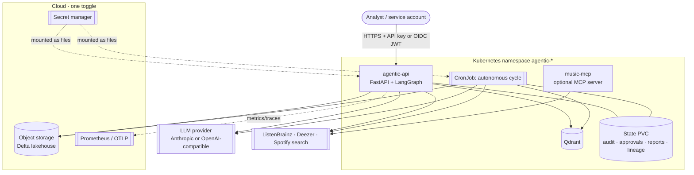
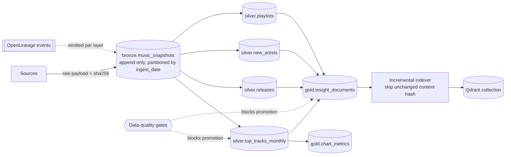
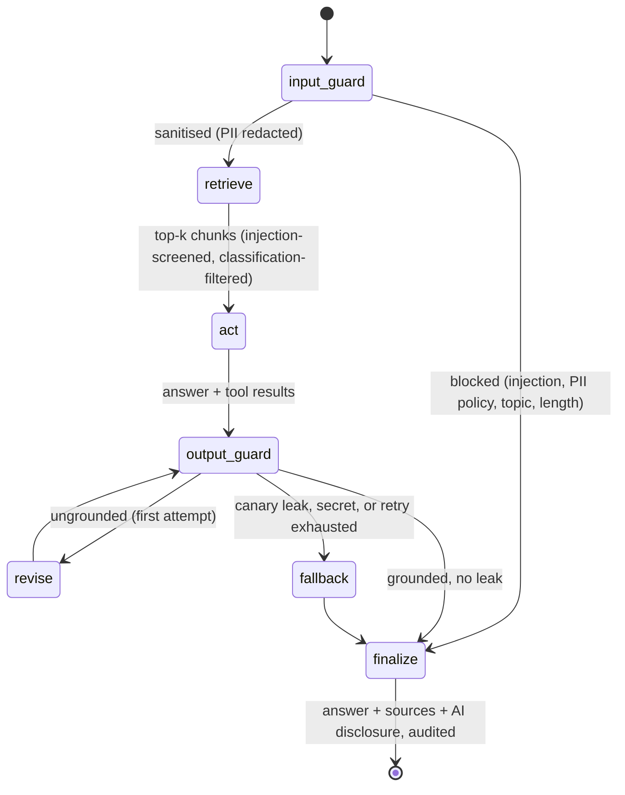
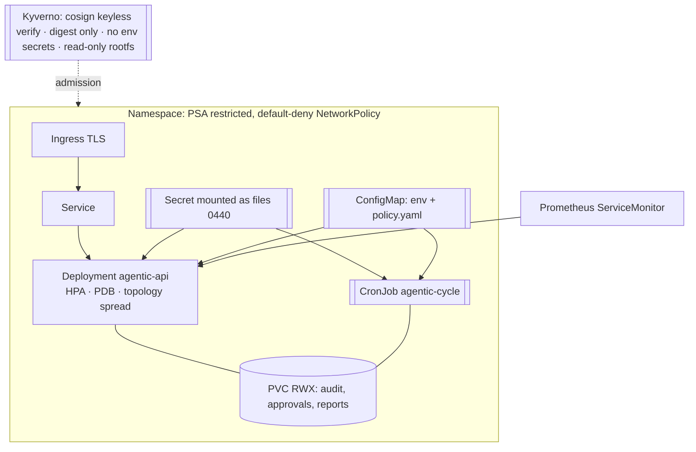

# Architecture

## 1. System context

## 2. Level by level

### Level 1 - Reddit agent
A tool-calling agent over four tools (subreddit posts, search, comments, subreddit info).
`RedditOAuthClient` does client-credentials OAuth, enforces a descriptive `User-Agent`, rate
limits, respects `Retry-After` and validates every path segment against injection. A fixtures
source provides deterministic data for tests and demos and is rejected in production by config
validation.

### Level 2 - music intelligence
`MusicIntelligenceService` fans out to ListenBrainz and Deezer (and optionally Spotify search),
normalises everything into `Track`/`Artist`/`Release`/`Playlist` models that always carry
`Provenance` (source, endpoint, fetched_at), and degrades gracefully: a failing source produces an
entry in `snapshot.errors` rather than an exception. Cross-source agreement between the
ListenBrainz monthly chart and the Deezer chart is computed with a Jaccard index over normalised
track keys. The same tools are exposed over MCP (stdio, or streamable HTTP with DNS-rebinding
protection).

### Level 3 - governed autonomous agent
Adds governance, a lakehouse, RAG, an API and autonomy. Components:

| Module | Responsibility |
|---|---|
| `governance/policy.py` | Policy engine: runtime, input, tool and output decisions, each with rule ids |
| `governance/guardrails.py` | PII detection/redaction, injection scoring, secret and canary detection |
| `governance/audit.py` | HMAC-SHA256 hash-chained audit log with verification |
| `governance/approvals.py` | Four-eyes approvals for high-risk actions |
| `responsible_ai/` | Fairness/diversity metrics and the generated system card |
| `data/` | Contracts (Arrow schemas), quality checks, Delta storage, medallion pipeline |
| `rag/` | Embeddings, Qdrant store, hybrid retrieval, incremental indexing |
| `graph/workflow.py` | LangGraph state machine wiring guardrails, retrieval and tools |
| `api/` | FastAPI app, authentication, RBAC, hardening middleware |
| `autonomy.py` | The cycle: ingest -> medallion -> index -> brief -> governed publication |
| `evaluation/` | Golden and red-team suites with thresholds from the policy |

## 3. Data architecture (medallion on Delta Lake)

- **Bronze** keeps the exact payload with a SHA-256 digest and any source errors: replayable.
- **Silver** applies the published Arrow contracts, deduplicates and is written with
  replace-where per `snapshot_date`, so re-running a day is idempotent.
- **Gold** holds fairness metrics and the curated documents that RAG is allowed to index. Only
  gold documents are indexed, which is the main defence against retrieval poisoning.
- **Quality gates** are declarative (`not_null`, `unique`, `in_range`, `min_rows`, `freshness`,
  `accepted_values`, `schema_contract`). Critical failures stop promotion, write an audit record
  and increment `agent_data_quality_failures_total`.
- **Lineage**: an OpenLineage-shaped event per layer is appended to `state/lineage/`.

## 4. Agent graph

Retrieved passages and tool results are always wrapped in `<untrusted_tool_output>` and are never
treated as instructions. Tool calls pass through the policy hook, so denials are audited even when
the model invents a tool name. Budgets (steps, tool calls, tokens) bound every run.

## 5. Retrieval

Dense search in Qdrant (cosine) retrieves `k*4` candidates filtered by classification; candidates
are screened for prompt injection and quarantined if suspicious; BM25 re-scores the survivors and
the two rankings are fused with Reciprocal Rank Fusion (k=60). Embeddings are pluggable: feature
hashing (offline/CI), `fastembed` ONNX models (local, nothing leaves the pod) or any
OpenAI-compatible `/v1/embeddings` endpoint. Indexing is incremental by content hash.

## 6. Kubernetes topology

Pods run as UID 10001, non-root, read-only root filesystem, all capabilities dropped,
`seccompProfile: RuntimeDefault`, no service-account token mounted. Egress is restricted to DNS,
in-release traffic and public HTTPS (private ranges excluded), plus the GKE metadata server when
workload identity needs it.

## 7. Cloud toggle

`AGENT_CLOUD` selects the storage scheme and credential chain; the configuration refuses
mismatches (`gs://` with `cloud=aws` fails at startup) and production additionally requires a
non-local cloud, a signed image digest, an HMAC audit key, real authentication, a server-side
vector store and a semantic embedding provider.

| Toggle | Storage | Identity | CD login |
|---|---|---|---|
| `local` | `./var/lakehouse` | none | - |
| `aws` | `s3://` | IRSA / Pod Identity | `configure-aws-credentials` (OIDC) |
| `gcp` | `gs://` | Workload Identity | `google-github-actions/auth` (WIF) |
| `azure` | `abfss://` | Workload Identity | `azure/login` (OIDC) |

## 8. Supply chain

```mermaid
flowchart LR
  pr[PR] --> gate[Pre-deploy gate<br/>lint · types · tests · SAST · CVEs · secrets · IaC · evals]
  gate --> build[Buildx multi-arch]
  build --> scan[Trivy image scan<br/>fails before signing]
  scan --> sbom[SPDX SBOM]
  sbom --> sign[cosign keyless sign + attest]
  sign --> prov[SLSA provenance attestation]
  prov --> cd[CD: verify signature → helm upgrade --atomic by digest]
  cd --> watch[deploy_watch: error budget → helm rollback]
  watch --> post[post_deploy_verify + ZAP]
  post --> report[gate_report: GO / NO-GO]
```

## 9. Threat model highlights

| Threat | Control |
|---|---|
| Direct prompt injection | Input guardrail with scored patterns (EN/ES), blocked before any tool or model call |
| Indirect injection via retrieved data | Only gold documents indexed; chunk screening and quarantine; untrusted-data wrapping |
| System prompt extraction | Random canary per agent instance; output containing it is never returned |
| Data exfiltration | SSRF allowlist, HTTPS-only, egress NetworkPolicy, secret scanning of outputs |
| Excessive agency | Tool allowlist and budgets; publication requires human approval |
| Credential theft | Secrets mounted as files, hashed API keys, OIDC federation, no static cloud keys |
| Tampering with evidence | HMAC hash-chained audit, verified in CI and exposed via an auditor-only endpoint |
| Supply-chain compromise | Pinned actions, frozen lockfile, SBOM, signed digests, Kyverno admission |
| Cost / DoS | Token and tool budgets, rate limits, body limits, cycle timeout, HPA bounds |
